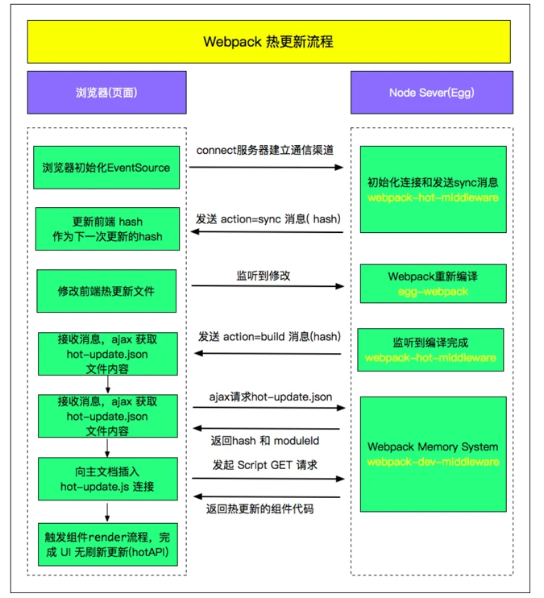

面试官你好，我叫XXX，XXXX年毕业于XXXX大学XXXXXXXX专业，（目前就职于），（当前岗位职责）。
XXXXXXXXXX...（围绕当前就职公司项目展开，可以初步介绍简历上的项目经验）
XXXXXXXXXX...（围绕自己在当前就职公司做的贡献，体现你的个人价值）
XXXXXXXXXX...（介绍一下在当前就职公司的绩效情况）
XXXXXXXXXX...（简单介绍一下跳槽的原因）

一面建议问题：1.团队规模怎么样？2.主要使用什么技术栈？3.主要业务是那些？
二面建议问题：1.您对面试者有那些期待？2.业务的未来发展方向是什么？3.您觉得我这次面试过程中有哪些可以改进的地方？
三面：可以针对聊的内容深入的提一个问题，也可以深入的问问业务未来发展方向
# CSS

## 元素隐藏的方法

* display: none
* visibility: hidden
* opacity: 0
* z-index
* position: absolute 移到可视区域外
* 缩放 transform:scale(0)
* overflow: hidden
* height: 0

# JS

## 为什么 setTimeout 有最小时延 4ms

HTML 规范中：

1. 如果设置的 timeout 小于 0，则设置为 0
2. 如果 timeout **嵌套的层级超过**了 5 层，并且 timeout 小于 4ms，则设置 timeout 为 4ms。

针对第一点：浏览器实现时不一定为 0，比如 chrome 最小的延迟为 1ms，火狐为 0ms。所以最小的延迟可以是 0，但是具体执行还是要看浏览器实现以及执行时的 event loop 其他函数操作。

> 如果浏览器允许 0ms，会导致 JavaScript 引擎过度循环，通过 0ms timer 不断安排唤醒系统，那么 event loop 就会被阻塞（一定会把所有的定时器执行完毕，不会响应用户操作了），网站很容易无响应

针对第二点：最早的 chromium 团队想要设置更低的延迟时间，但是由于某些网站对 setTimeout 的不良使用（嵌套），设置延迟过低会导致 CPU-spinning（也叫忙碌等待），无法进入低功耗模式，并且掉电速度很快。所以测试之后最后做了权衡，其他浏览器也都使用了这个数值

## 数组遍历方式以及速度

速度快慢排序：

1、for === while

2、for of ≈ forEach ≈ for in

3、map （修改原数组，浅拷贝时不占空间）

## this 指向问题

```js
const o1 = {
    text: 'o1',
    fn: function() {
        return this.text;
    }
}
const o2 = {
    text: 'o2',
    fn: o1.fn
}
console.log(o2.fn());
```

答案：o2 这里的坑在于习惯性的以为函数被谁调用 this 指向谁，但其实最终调用的时候，是 o2 的执行上下文去堆里面的 fn 函数的地址拿出来的，所以是 o2 ，o2 的 fn 和 o1 的 fn是同一个地址

## valueOf 和 toString

### toString

来自于原型链 Object.prototype.toString()，其他类型的原型链也有继承

功能：把传入的参数转换成字符串

对象：'[object Object]'

数组：相当于数组方法 Array.join(',')   [1,2,3] => '1,2,3'

函数：直接转换 'function(){ console.log('fn') }'

作用：某些场合判断类型更准确

```javascript
toString.call(()=>{})       // [object Function] 
toString.call([])           // [object Array] 
toString.call('')           // [object String] 
toString.call({})           // [object Object] 
toString.call(undefined)    // [object undefined] 
toString.call(null)         // [object null] 
toString.call(22)           // [object Number] 
toString.call(new Date)     // [object Date] 
toString.call(Math)         // [object Math] 
toString.call(window)       // [object Window]
```

#### 什么时候自动调用

使用操作符的时候，如果其中一边为对象，则会先调用 toSting 方法，也就是隐式转换

### valueOf

也来自原型链，返回当前对象的原始值

### 区别

共同点：在输出对象时会自动调用。

不同点：默认返回值不同，且存在优先级关系。

1、强转字符串类型时，将优先调用 toString 方法，强转为数字时优先调用 valueOf

2、使用运算操作符的情况下，valueOf 的优先级高于 toString

## 嵌套的 Promise 执行顺序


如果 外层第一个 then 中没有返回 Promise，那么在把内层的第一个 then 加入到队列之后，把能执行的都执行了默认返回 undefined 然后把外层 Promise 的 第二个 then 加入到队列

如果返回了 Promise，那么内层 Promise 的 then 全部执行完毕之后才会把外层的 then 加入到队列

## Promise.resolve()

本质：表示 promise 的状态为 fullfilled，可以放 then 方法进入微任务队列

### 1、参数是一个 Promise 实例

Promise.resolve 将不做任何修改、原封不动地返回这个实例。如果有 then 方法会马上推入微任务队列

### 2、参数是一个 thenable 对象

将这个对象转为 Promise 对象，thenable 对象的 then 方法立即推入微任务队列。

### 3、参数不是具有 then方法 的对象，或根本就不是对象

返回一个新的 Promise 对象，状态为 resolved

### 4、不带有任何参数

返回一个 resolved 状态的 Promise 对象，同时 then 方法推入微任务队列。

### 5、Promise.resolve(v)不等于new Promise(r => r(v))

如果是 Promise 里的 resolve(v)，这一句就单独算一个微任务推入队列，而不是立即把 then 推入微任务队列

```javascript
// v是一个实例化的promise，且状态为fulfilled
let v = new Promise(resolve => {
  console.log("begin");
  resolve("then"); 
});
// 最大的陷阱是有些题不写这句话，然而实例 v 中 resolve 之后都会先推入 v 的 .then 然后才
// 推入 new Promise 中的 resolve。就算 v 没有 then 方法也会等待这个不存在的 then 处理完
// 实例 v 状态才会变成 fulfilled
v.then(()=>{console.log('我也会执行')}) 
//--------------------
// 第一种情况：new Promise，结果：begin->1->2->3->then->4
new Promise(resolve => {
    resolve(v);
}).then((v)=>{
    console.log(v)
});

// 第二种情况：直接Promise.resolve(v)，结果：begin->1->then->2->3->4
//原因：Promise.resolve()API如果参数是promise会直接返回这个promise实例，不会做任何处理
// 也就是上面的第一条
Promise.resolve(v).then((v)=>{
    console.log(v)
});
//--------------------
new Promise(resolve => {
  console.log(1);
  resolve();
}).then(() => {
  console.log(2);
}).then(() => {
  console.log(3);
}).then(() => {
  console.log(4);
});
```

## async await的顺序

遇见 await xx() 时，进入 xx 正常执行，碰见微任务就放入微任务队列中，同步任务直接输出。但是微任务如果没做完，下面同步任务也不会执行，所以叫 wait

## try catch

能捕捉到的异常必须是线程执行已经进入 try catch 但 try catch 未执行完的时候抛出来的

同步任务的错误可以捕获

如果 try 里面是异步任务，比如 定时器、Promise，这些异步任务推入对应的任务队列之后，tye catch 的上下文已经不存在了，所以捕获不到错误

除非使用 async await，try 必须等到微任务完成之后才可以往下走，从而结束自己，所以此时可以捕获到，宏任务不用管，因为不属于 await 的处理范畴，加了 await 也是照常推入队列，按宏任务队列顺序输出

## 抽象类

抽象类中可以有非抽象方法，有抽象方法的一定都是抽象类

抽象类不可以被实例化，

抽象类中的抽象方法必须被子类实现

# HTTP 网络

## Cookie

cookie 遵从同站原则，只要是 eTLD+1: 有效顶级域名+二级域名相同即可，如 `taobao.com,baidu.com,sugarat.top`，不需要考虑协议和端口

同源更严格：协议、域名、端口都一致

### Cookie 的属性

#### Expires，Max-Age

Expires：指定一个具体的到期时间，值是 UTC 格式的本地时间，不设置该属性，或者设为 null，Cookie 只在当前会话（session）有效，浏览器窗口关闭，该 Cookie 就会被删除

Max-Age：指定从现在开始 Cookie 存在的秒数

优先级 Max-Age 高

#### Domain，Path

Domain：哪些域名要附带这个 Cookie。默认是当前的二级域名（.com这种才是顶级域名或者叫一级域名），如果服务器在 Set-Cookie 字段指定的域名，不属于当前域名，浏览器会拒绝这个 Cookie，比如阿里的网站设置百度的域名

Path：哪些路径要附带这个 Cookie，设置`/`那么`/docs`也会携带

#### Secure，HttpOnly

Secure：HTTPS 下，才能将这个 Cookie 发送到服务器

HttpOnly：该 Cookie 无法通过 JavaScript 脚本拿到

#### SameSite

比如在掘金点击知乎的链接，设置 strict 不会发送 cookie，永远未登录。Lax 则会在链接，预加载请求，GET 表单时发送，none 无限制。防止 CSRF 攻击（跨站请求伪造）

HTTP 不支持 None，必须同时加上 Secure 属性

### Cookie 的作用

主要用于以下三个方面：

1. 会话状态管理（如用户登录状态、购物车、游戏分数或其它需要记录的信息）
2. 个性化设置（如用户自定义设置、主题等）
3. 浏览器行为跟踪（如跟踪分析用户行为等）

### Cookie 的缺点

可以从大小、安全、增加请求的大小等方面回答。

### 同站和同源时存储与发送 cookie 的不同

同源时存储和发送都没有问题（毕竟最严格，完全相等）

不同源时分场景：

1、未设置跨域：`XMLHttpRequest.withCredentials=false`搭配服务端的 Access-Control-Allow-Credentials。浏览器不会存储与发送 cookie

2、设置了跨域：`XMLHttpRequest.withCredentials=true`

* 同站：使用 HTTPS 协议的 API，不论 `samesite` 的值，正常存储+发送 cookie。HTTP 协议的 API，只会存储 `samesite` 的值为 `Lax` 和 `Strict` 的 cookie，正常发送 cookie
* 跨站：只能存储和发送  `samesite` 值为 none 的 cookie，并且是 HTTPS 协议（规定），设置了 secure 属性

## Etag 生成原理

不同服务器上生成算法不同，一般而言有几个主要参数可以选择

INode：文件的索引节点(inode)数

MTime： 文件的最后修改日期及时间

Size： 文件的字节数

举例：nginx 中 etag 由响应头的 Last-Modified 与 Content-Length 表示为十六进制组合而成。

```json
ETag: "5cbee66d-264" // 前面是修改时间的十六进制，后面是内容长度的16进制
```

### 如果 http 响应头中 ETag 值改变了，不意味着文件内容一定已经更改

当编辑文件却未更改文件内容时，或者 touch file，MTime 也会改变，此时 etag 改变。当然如果算法没有使用 MTime，就不会改变

### 为什么一般不用 Etag

大厂一般负载均衡调度 HTTP 请求。所以同个客户端的请求很可能分到不同服务器，而根据etag 计算原理，不同服务器资源没变化的情况下，算法可能计算出不同的etag

## Cookie Session Token(jwt) 对比

* HTTP 是无状态的，为了维持前后请求，需要前端存储标记
* cookie 是一种完善的标记方式，通过 HTTP 头或 js 操作，有对应的安全策略，是大多数状态管理方案的基石
* session 是一种状态管理方案，前端通过 cookie 存储 id，后端也要专门存储 id 数据，并且要处理分布式问题，负载均衡时不同机器，需要统一的持久层
* token 是另一种状态管理方案，相比于 session 不需要后端存储，数据全部存在前端，解放后端，释放灵活性
* token 的编码技术，通常基于 base64，或增加加密算法防篡改，jwt 是一种成熟的编码方案
* 在复杂系统中，token 可通过 service token（业务的存活时间短暂）、refresh token（刷新的存活时间长） 的分权，同时满足安全性和用户体验
* session 和 token 的对比就是「用不用cookie」和「后端存不存」的对比
* 单点登录要求不同域下的系统「一次登录，全线通用」，通常由独立的 SSO 系统记录登录状态、下发 ticket，各业务系统配合存储和认证 ticket

## 客户端（浏览器）缓存

用户不用访问服务器，直接使用内存缓存或硬盘缓存

### 缺点

网站发生了更新，浏览器本地仍保存着旧版本的文件，从而导致无法预料后果

### 几种浏览器刷新方式对缓存的处理

1. 在地址栏中输入网址后按回车或点击转到按钮

浏览器以最少的请求来获取网页的数据，浏览器会对所有没有过期的内容直接使用本地缓存，从而减少了对浏览器的请求。所以，强缓存 Expires，max-age 标记只对这种方式有效

1. 按F5或浏览器刷新按钮

浏览器会在请求中附加必要的协商缓存，**不允许**浏览器直接使用本地缓存，它能够让 Last-Modified、ETag发挥效果。

1. 按 Ctrl+F5 或按 Ctrl 并点击刷新按钮

全部用最新的

## CDN缓存是什么

浏览器先检查是否有本地缓存是否过期，如果过期，则向 CDN 边缘节点发起请求

CDN边缘节点会检测用户请求数据的缓存是否过期，如果没有过期，则直接响应用户请求

如果数据已经过期，那么 CDN 还需要向源站发出回源请求

### 缺点

即便用户再浏览器使用 Ctrl +F5 的方式使浏览器端的缓存失效，也会因为CDN边缘节点没有同步最新数据而导致用户访问异常。此时只能通过运营商提供的 CDN 刷新缓存，我司 CMS 就有

# 安全

## CSRF(跨站请求伪造)

本质：一旦用户通过网站服务的身份认证，网站就完全信任该用户，受害者持有的权限级别决定了CSRF攻击的影响范围。

### CSRF 攻击流程

1. 用户浏览并登陆信任网站A。
2. 网站A验证通过后，在用户处产生A的Cookie。
3. 用户在没有退出网站A的情况下，访问了危险网站B。
4. 危险网站B要求用户访问第三方站点A，并发出了一个请求。
5. 用户根据危险网站B的要求，携带着A的cookie对网站A进行了请求。
6. 网站A并不知道这个请求是用户发出的还是危险网站B发出的，但是因为这个cookie的存在，A会处理这个请求，从而危险网站B达到了自己获取用户信息的目的。

### 常见的 CSRF 攻击类型

#### GET类型的CSRF攻击

举例：攻击者在页面放入一个img标签，这个标签的 src 属性指向银行页面的接口

#### POST类型的CSRF

一个隐藏的 input 表单，当受害者访问该页面的时候，这个表单会自动使用获取到的用户信息进行提交

```html
<form action="http://bank.example/withdraw" method=POST>

    <input type="hidden" name="account" value="xiaoming" />

    <input type="hidden" name="amount" value="10000" />

    <input type="hidden" name="for" value="hacker" />

</form>

<script> document.forms[0].submit(); </script>
```

#### 链接类型的CSRF

```html
<a href="http://test.com/csrf/withdraw.php?amount=1000&for=hacker" taget="_blank">
    重磅消息！！
<a/>
```

#### CSRF的特点

* CSRF（通常）发生在第三方域名。
* CSRF攻击者不能获取到Cookie等信息，只是使用。

### 防护策略

阻止不明外域的访问

1、同源检测

2、Samesite Cookie

提交时要求附加本域才能获取的信息

1、 CSRF Token

2、双重Cookie验证

### 同源检测

通过两个 HTTP 请求头，大多数情况会自动带上，并且不能由前端自定义内容。同源验证是一个相对简单的防范方法，能够防范绝大多数的 CSRF 攻击。但这并不是万无一失的

#### Origin Header

字段内包含请求的域名（不包含path及query）

有两种情况不存在：

1、IE11同源策略，Referer 头仍然是唯一的标识

2、302临时重定向：在 302 重定向之后 Origin 不包含在重定向的请求中，因为Origin可能会被认为是其他来源的敏感信息

#### Referer Header

记录了 HTTP 请求的来源地址。这种做法同样也不保险，攻击者可以隐藏这个字段。所以两个字段都没有的时候应该直接阻止请求

设置Referrer Policy的方法有三种：

在CSP设置

页面头部增加meta标签

a标签增加referrerpolicy属性

### CSRF Token

1、 将CSRF Token生成到页面中

2、 页面提交的请求携带这个Token

3.、服务器验证Token是否正确

这种方法工作量巨大，且有可能遗漏（验证码和二次输入的密码也可以起到同样作用）

### 双重Cookie验证

利用CSRF攻击**不能获取和操作**到用户Cookie 的特点，我们可以要求 Ajax 和表单请求携带一个Cookie中的值。

* 在用户访问网站页面时，向请求域名注入一个Cookie，内容为随机字符串（例如csrfcookie=v8g9e4ksfhw）。
* 在前端向后端发起请求时，取出 Cookie，并添加到URL的参数中（接上例POST https://www.a.com/comment?csrfcookie=v8g9e4ksfhw）。
* 后端接口验证Cookie中的字段与URL参数中的字段是否一致，不一致则拒绝。

但是跨域了这个方案就无效，因为 cookie 无法获取，影响正常网站。如果种在父域上被 xss 攻击了会被伪造

### Samesite Cookie属性

1、Samesite Cookie：Strict，浏览器在任何跨域请求中都不会携带Cookie，新标签重新打开也不携带，CSRF 攻击基本没有机会，但也失去了很多同步的功能

2、SamesiteCookie：Lax，那么其他网站通过页面跳转过来的时候可以使用Cookie，可以保障外域连接打开页面时用户的登录状态。

### 总结

CSRF自动防御策略：同源检测（Origin 和 Referer 验证）。

CSRF主动防御措施：Token验证 或者 双重Cookie验证 以及配合Samesite Cookie。

保证页面的幂等性，后端接口不要在GET页面中做用户操作。

# Vue

## v-if 和 v-for

2.x 版本中v-for 会优先作用。

3.x 版本中 v-if 总是优先于 v-for 生效

## nextTick 原理

本质：利用事件循环推迟函数运行。注意如果是在修改值之前调用，由于组件更新

原理分析：

1、把回调函数放入 callbacks 队列中等待执行

2、外层包裹函数 timerFunc 将刷新函数 flushCallbacks 放到微任务或者宏任务中（根据环境做降级处理：Promise、MutationObserver、setImmediate、setTimeout）

3、事件循环到了微任务或者宏任务，刷新函数 flushCallbacks 依次执行 callbacks 中的回调

## 异步更新dom原理

Data 对象：vue中的data方法中返回的对象

Dep 对象：每一个Data属性都会创建一个Dep，用来搜集所有使用到这个Data的Watcher对象

Watcher 对象：组件视图对象，主要用于渲染DOM

> vue 在调用 Watcher 更新视图时，并不会直接进行更新，而是把需要更新的 Watcher加入到 queueWatcher 队列里，然后把具体的更新方法 flushSchedulerQueue 传给nexTick 进行调用。

当 Data 中的数据 a 更新时

1. 触发 a.set

2. 调用 dep.notify

3. Dep 会遍历这个数据所有相关的 Watcher 执行 update 方法，将每个 Watcher 添加到 queueWatcher  队列，并且把刷新视图的方法放入 nextTick 作为回调异步执行

`nextTick(flushSchedulerQueue)`

> flushSchedulerQueue 函数中会排序，先渲染父节点，再渲染子节点。可以避免不必要的子节点渲染，如父节点中 v-if 为 false 的子节点，就不用渲染了`queue.sort((a, b) => a.id - b.id)` 。然后遍历 queueWatcher 队列执行 Watcher.run 方法更新视图渲染节点

# Git

## reset 和 revert

reset：把目标提交后面的提交全部取消

revert：只撤销中间某一个版本的提交，sourcetree 上是回滚提交

# Npm

## 依赖包版本前的符号的含义

major.minor.patch（有点像 CSGO 比赛）

主版本号.次版本号.修补版本号

### 1、不带任何符号

**必须依赖**这个版本的包

### 2、>、>=、 <、 <=

这几个符号很简单，就是数学意义上的关系，大于、大于等于、小于、小于等于这个版本的安装包都行

### 3、~

向上匹配版本，但不能越级

~1.1.2: 大于等于1.1.2 小于 1.2

~1.1: 大于等于1.1，小于1.2

~1 大于等于1，小于2

### 4、^

小于版本号中最左边的非0数字加1，其余部分，大于等于当前值。

### 5、x

x 的位置表示任意版本

### 6、version1 - version2

大于等于version1，小于等于version2

## 依赖包前的符号

### @

表示这是个范围包，类似作用域，不带符号的是公共包，重名了就不能发

## npm 和 yarn 的区别

早期 npm 没有 packege-lock.json，所以安装依赖不稳定

最新版本二者没有太大差距：锁定依赖、缓存机制 一样

yarn 并行安装更快，输出更加简洁

npm 串行

### 需不需要提交 lockfiles 到仓库中

如果是开发应用，建议提交，保持大家安装的一致

如果是库，不需要。可以复用主项目已经加载过的包，减少依赖重复和体积

### 各种 xxxDependencies

1. dependencies 项目依赖：只要有使用就一定会被打包到线上
2. dependencies 项目依赖：开发使用，不会被打包
3. peerDependencies 同版本的依赖：如果你已经安装我了, 那么你最好也安装我需要的宿主环境依赖。一般在开发库的时候指定某个依赖，dependencies 保证在用户没有安装相应包的时候去自动安装，peerDependencies 用于在用户已安装相应包时校验包版本是否符合要求

# 设计模式

## 单例模式

```js
let CreateSingleton = (function(){
    let instance;
    return function(name) {
        if (instance) {
            return instance;
        }
        this.name = name;
        return instance = this;
    }
})();
```

# Webpack

## HMR 热替换原理

### 三个插件

1. Webpack-dev-server:一个服务器插件，相当于 express 服务器，启动一个 web 服务器，只适用于开发环境
2. Webpack-dev-middleware: Webpack-dev-server 的中间件,作用是监听资源变更，然后进行打包
3. Webpack-hot-middleware: 中间件，可以实现浏览器的无刷新更新

### 流程

Webpack编译期，为需要热更新的 entry 注入热更新代码(EventSource通信)
页面首次打开后，服务端与客户端通过 EventSource 建立通信渠道，把下一次的 hash 返回前端
客户端获取到hash，这个hash将作为下一次请求服务端 hot-update.js 和 hot-update.json的hash
修改页面代码后，Webpack 监听到文件修改后，开始编译，编译完成后，发送 build 消息给客户端
客户端获取到hash，成功后客户端构造hot-update.js script链接，然后插入主文档
hot-update.js 插入成功后，执行hotAPI 的 createRecord 和 reload方法，获取到 Vue 组件的 render方法，重新 render 组件， 继而实现 UI 无刷新更新。


